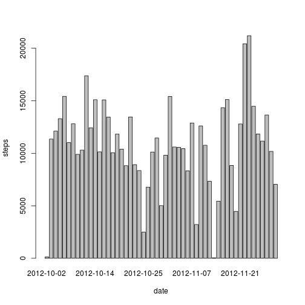
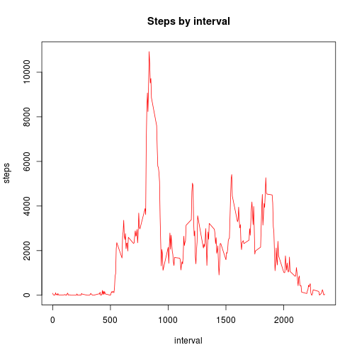
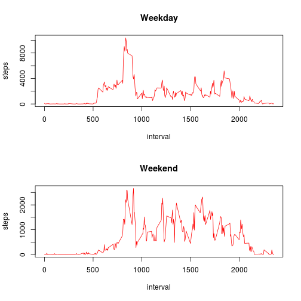

## Loading and preprocessing the data ##


```r
setwd("/home/user/reproducible_research/peer_assessment_1")

# Download data
url <- "https://d396qusza40orc.cloudfront.net/repdata%2Fdata%2Factivity.zip"
data_file <- "repdata_data_activity.zip"
file_name <- "activity.csv"

# Download file if it is not in the directory 
if (!file.exists(data_file)) {
  cat("Downloading", data_file, "at", getwd(), "...\n")
  download.file(url, data_file, method = "curl")
}

# Unzip file if the file don't exist (it is packed in the zip file)
if (!file.exists(file_name)) {
  cat("Unziping file", data_file, "at", getwd(), "...\n")
  unzip(data_file, list = FALSE, overwrite = TRUE)
}
```

### Process/transform the data (if necessary) into a format suitable for your analysis ###


```r
df_activity_complete <- read.csv(file_name)
df_activity <- na.omit(df_activity_complete)
```

## What is the mean total number of steps taken per day?

1. Make a histogram of the total number of steps taken each day


```r
library(plyr)

steps_by_day <- ddply(df_activity, .(date), summarize, total_steps = sum(steps))
colnames(steps_by_day)
```

```
## [1] "date"        "total_steps"
```

```r
hist(steps_by_day$total_steps, xlab = "steps", main = "Steps by day")
```

 

```r
barplot(steps_by_day$total_steps, names.arg = steps_by_day$date, xlab = "date", ylab = "steps")
```

 


2. Calculate and report the **mean** and **median** total number of
   steps taken per day

```r
mean(steps_by_day$total_steps)
```

```
## [1] 10766
```

```r
median(steps_by_day$total_steps)
```

```
## [1] 10765
```

## What is the average daily activity pattern?

1. Make a time series plot (i.e. `type = "l"`) of the 5-minute
   interval (x-axis) and the average number of steps taken, averaged
   across all days (y-axis)


```r
steps_by_interval <- ddply(df_activity, .(interval), summarize, total_steps = sum(steps), average_steps = mean(steps))
colnames(steps_by_interval)
```

```
## [1] "interval"      "total_steps"   "average_steps"
```

```r
plot(total_steps ~ interval, type = "l", data = steps_by_interval, ylab = "steps", main = "Steps by interval", col = "red")
```

 

2. Which 5-minute interval, on average across all the days in the
   dataset, contains the maximum number of steps?


```r
steps_by_interval$interval[which.max(steps_by_interval$total_steps)]
```

```
## [1] 835
```


## Imputing missing values

1. Calculate and report the total number of missing values in the
   dataset (i.e. the total number of rows with `NA`s)


```r
sum(is.na(df_activity_complete))
```

```
## [1] 2304
```

2. Devise a strategy for filling in all of the missing values in the
   dataset. The strategy does not need to be sophisticated. For
   example, you could use the mean/median for that day, or the mean
   for that 5-minute interval, etc.

**My solution is to use the means for the 5-minute intervals as fillers**
**for missing values.**

3. Create a new dataset that is equal to the original dataset but with
   the missing data filled in.


```r
df_activity_filled <- merge(df_activity_complete, steps_by_interval[c("interval", "average_steps")], by="interval")
df_activity_filled$steps <- ifelse(!is.na(df_activity_filled$steps), df_activity_filled$steps, df_activity_filled$average_steps)
```

4. Make a histogram of the total number of steps taken each day and
   Calculate and report the **mean** and **median** total number of
   steps taken per day. Do these values differ from the estimates from
   the first part of the assignment? What is the impact of imputing
   missing data on the estimates of the total daily number of steps?


```r
steps_by_day_filled <- ddply(df_activity_filled, .(date), summarize, total_steps = sum(steps))
hist(steps_by_day_filled$total_steps, xlab = "steps", main = "Steps by day")
```

 

**Means are equal in both cases and the median completing NAs, now tends logically to the mean.**


```r
mean(steps_by_day_filled$total_steps)
```

```
## [1] 10766
```

```r
median(steps_by_day_filled$total_steps)
```

```
## [1] 10766
```

**My conclusion is that just to analyze the number of steps by day the**
**missing data doesn't seem to affect in a sensitive way.**

## Are there differences in activity patterns between weekdays and weekends?

1. Create a new factor variable in the dataset with two levels --
   "weekday" and "weekend" indicating whether a given date is a
   weekday or weekend day.


```r
# Calculate type of date
daytype <- function(date) {
  if (weekdays(as.Date(date)) %in% c("Saturday", "Sunday")) {
    "weekend"
  } else {
    "weekday"
  }
}

# Apply factor
df_activity_filled$daytype <- as.factor(sapply(df_activity_filled$date, daytype))
```

2. Make a panel plot containing a time series plot (i.e. `type = "l"`)
   of the 5-minute interval (x-axis) and the average number of steps
   taken, averaged across all weekday days or weekend days
   (y-axis).


```r
# Aggregate by daytype
aggregate_by_daytype <- function(daytype) {
  data <- df_activity_filled[df_activity_filled$daytype == daytype,]
  data <- ddply(data, .(interval), summarize, total_steps = sum(steps))
  data[c("interval", "total_steps")]
}

# Apply function to type of days
steps_by_interval_filled_weekday <- aggregate_by_daytype("weekday")
steps_by_interval_filled_weekend <- aggregate_by_daytype("weekend")

# Plot
par(mfrow = c(2,1))
plot(total_steps ~ interval, type = "l", data = steps_by_interval_filled_weekday, main = "Weekday", ylab = "steps", col = "red")
plot(total_steps ~ interval, type = "l", data = steps_by_interval_filled_weekend, main = "Weekend", ylab = "steps", col = "red")
```

 

**Not many differences in the activity patterns between weekdays and**
**weekends. On weekend the subject seem to have more activity.**
