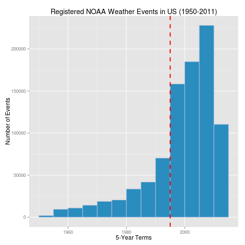
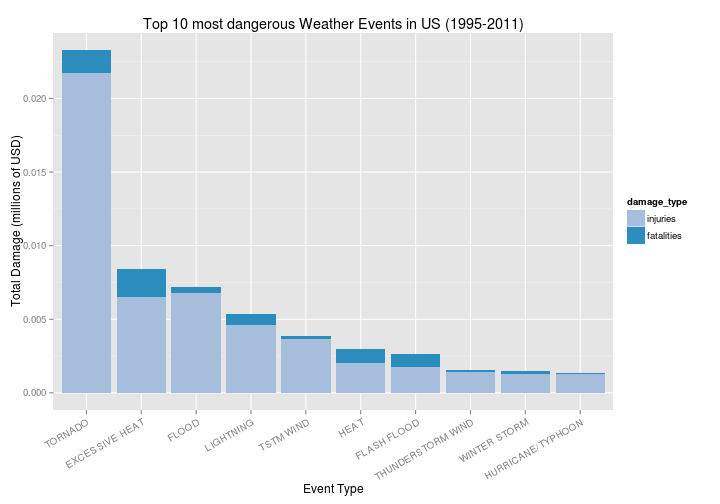
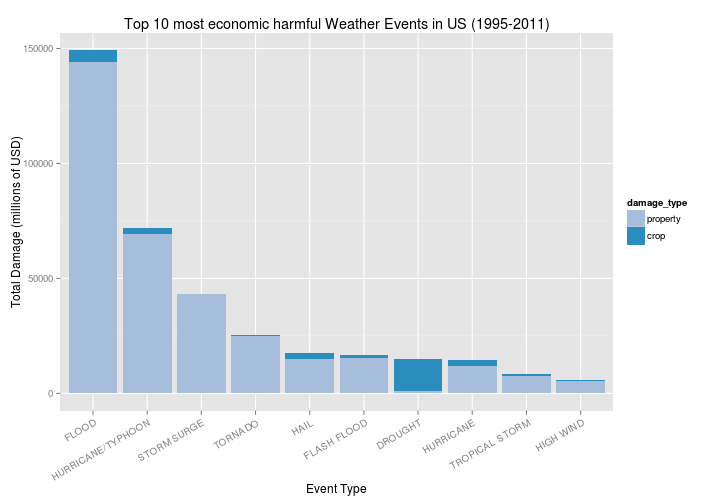

### 1. Assignment

The basic goal of this assignment is to explore the NOAA Storm Database and answer some basic questions about severe weather events. You must use the database to answer the questions below and show the code for your entire analysis. Your analysis can consist of tables, figures, or other summaries. You may use any R package you want to support your analysis.

### 2. Synopsis

In this study, we aim to analyze the impact of the most harmful weather events on public health and economy, based on data collected from the National Oceanic and Atmospheric Administration (NOAA) storm dataset. This database contains some useful variables as the type of storm event, date, location, number of human injuries and fatalities and economic damage estimations from 1950 - 2011 in the United States.  

We investigate the events from two points of view, personal and economic damage, and we conclude there is no a direct correlation between them. From the data, we found that heat and tornado weather events are the most harmful for humans, while when we focus on the economic consequences, flood, drought and hurricane/typhoon are the events that cause more damage.

### 3. Data Processing


##### 3.1. Load libraries


```r
library(R.utils)  # bunzip2
library(plyr)     # aggregate
library(reshape2) # melt function for plotting
library(ggplot2)  # plotting
library(knitr)    # Rmd file to html

# Turn off scientific notations for numbers
options(scipen = 1)
```

##### 3.2. Download source, extract and read data file


The RData is loaded from a RData file when available, just to skip downloading and processing the data again when rerunning the code.

Otherwise we start loading the specified source files from URL and storing it locally.
The data is provided as a bz2-zipped .csv file. Thus we unzip it after downloading and load it into R.


```r
# Download data
rdata_file <- "./data/StormData.RData"

create_rdata_file <- TRUE
# Check if file StormData.RData already exists
if (file.exists(rdata_file)) {
  load(rdata_file)
  create_rdata_file <- FALSE
}

if (create_rdata_file) {
  # Create a data dir if it doesn't exist
  if (!file.exists("./data")) {
    dir.create("./data")
  }
  
  # Download file if it is not in the directory 
  url <- "https://d396qusza40orc.cloudfront.net/repdata/data/StormData.csv.bz2"
  file_name <- "./data/StormData.csv"
  bz2_file <- "./data/StormData.csv.bz2"
  if (!file.exists(bz2_file)) {
    cat("Downloading", bz2_file, "at", getwd(), "...\n")
    download.file(url, bz2_file, method = "curl")
  }
  
  # Unzip bz2 file to extract csv
  if (!file.exists(file_name)){
    bunzip2(bz2_file, file_name, overwrite = TRUE, remove = FALSE)
  }

  # Load data and store them in stormdata data frame
  df_stormdata <- read.csv(file_name, header = TRUE, stringsAsFactors = FALSE, strip.white = TRUE)
}
```


```r
dim(df_stormdata)
```

```
## [1] 902297     38
```

```r
c(min(df_stormdata$BGN_DATE), max(df_stormdata$BGN_DATE))
```

```
## [1] "1950-01-03 CET" "2011-11-30 CET"
```

There are 902297 rows and 37 columns in total (38 if readed from RData file with year column).
The registered events in the database start in the year 1950 and end in November 2011.


```r
head(df_stormdata)
```

```
##   STATE__   BGN_DATE BGN_TIME TIME_ZONE COUNTY COUNTYNAME STATE  EVTYPE
## 1       1 1950-04-18     0130       CST     97     MOBILE    AL TORNADO
## 2       1 1950-04-18     0145       CST      3    BALDWIN    AL TORNADO
## 3       1 1951-02-20     1600       CST     57    FAYETTE    AL TORNADO
## 4       1 1951-06-08     0900       CST     89    MADISON    AL TORNADO
## 5       1 1951-11-15     1500       CST     43    CULLMAN    AL TORNADO
## 6       1 1951-11-15     2000       CST     77 LAUDERDALE    AL TORNADO
##   BGN_RANGE BGN_AZI BGN_LOCATI END_DATE END_TIME COUNTY_END COUNTYENDN
## 1         0                                               0         NA
## 2         0                                               0         NA
## 3         0                                               0         NA
## 4         0                                               0         NA
## 5         0                                               0         NA
## 6         0                                               0         NA
##   END_RANGE END_AZI END_LOCATI LENGTH WIDTH F MAG FATALITIES INJURIES
## 1         0                      14.0   100 3   0          0       15
## 2         0                       2.0   150 2   0          0        0
## 3         0                       0.1   123 2   0          0        2
## 4         0                       0.0   100 2   0          0        2
## 5         0                       0.0   150 2   0          0        2
## 6         0                       1.5   177 2   0          0        6
##   PROPDMG PROPDMGEXP CROPDMG CROPDMGEXP WFO STATEOFFIC ZONENAMES LATITUDE
## 1    25.0          K       0                                         3040
## 2     2.5          K       0                                         3042
## 3    25.0          K       0                                         3340
## 4     2.5          K       0                                         3458
## 5     2.5          K       0                                         3412
## 6     2.5          K       0                                         3450
##   LONGITUDE LATITUDE_E LONGITUDE_ REMARKS REFNUM year
## 1      8812       3051       8806              1 1950
## 2      8755          0          0              2 1950
## 3      8742          0          0              3 1951
## 4      8626          0          0              4 1951
## 5      8642          0          0              5 1951
## 6      8748          0          0              6 1951
```

##### 3.3. Look for time series
Convert column `BGN_DATE` to date.


```r
# Format date and extract year column
df_stormdata$BGN_DATE <- as.POSIXct(df_stormdata$BGN_DATE, format = "%m/%d/%Y %H:%M:%S")
df_stormdata$year <- as.numeric(format(df_stormdata$BGN_DATE, "%Y"))
```


##### 3.4. Data exploration histogram
In the earlier years of the database there are generally fewer events recorded, most likely due to a lack of good records. More recent years should be considered more complete.


```r
# Histogram of data
ggplot(df_stormdata, aes(x = year)) +
  geom_histogram(breaks = seq(1950, 2015, by = 5), colour = "#a6bddb", fill = "#2b8cbe") +
  geom_vline(aes(xintercept = 1995), color = "red", linetype = "dashed", size = 1) +
  xlab("5-Year Terms") +
  ylab("Number of Events") +
  ggtitle("Registered NOAA Weather Events in US (1950-2011)")
```

 

Based on the histogram above, we observed that the number of events tracked starts to significantly increase around 1995. So, we use the subset of the data from 1995 to 2011.

##### 3.5. Reduce the dataset
For this analysis we just need the columns `year`, `EVTYPE`, `FATALITIES`, `INJURIES`, `PROPDMG`, `PROPDMGEXP`, `CROPDMG`, `CROPDMGEXP`.


```r
# Subset variables related to health and economic analysis
storm <- df_stormdata[df_stormdata$year >= 1995,
                      c("year", "EVTYPE", "FATALITIES", "INJURIES", "PROPDMG",
                        "PROPDMGEXP", "CROPDMG", "CROPDMGEXP")]
dim(storm)
```

```
## [1] 681500      8
```

Now, there are 681500 rows and 8 columns in total.

##### 3.6. Apply exponentiation to columns
Both `PROPDMGEXP` and `CROPDMGEXP` columns record a multiplier for each observation, as described in the code book ([Storm Events](http://ire.org/nicar/database-library/databases/storm-events/)). Where we have Hundred (H), Thousand (K), Million (M) and Billion (B).

We will convert the **property damage** and **crop damage** data into comparable numerical forms according to the meaning of units. 


```r
# Lookup exponents
unique(append(unique(storm$PROPDMGEXP), unique(storm$CROPDMGEXP)))
```

```
##  [1] ""  "B" "M" "K" "m" "+" "0" "5" "6" "?" "4" "2" "3" "7" "H" "-" "1"
## [18] "8" "k"
```

Then, create a function to apply a number a power of 10 specified by the second parameter.
Advertise that undefined EXP properties, like +, - or ? are multiply by number 1 (num^0).


```r
# Apply to a number a power of 10
apply_power_to_number <- function(num, exp) {
  pow <- 0
  if (is.numeric(exp)) {
    pow <- exp
  } else { 
    if (exp == "") {
      pow <- 0
    } else {
      exp <- toupper(exp)
      if (exp == "H") pow <- 2
      else if (exp == "K") pow <- 3
      else if (exp == "M") pow <- 6
      else if (exp == "B") pow <- 9
    }
  }
  # Return result
  result <- num * 10^pow
}

# Create calculated property and crop damages
storm$property <- mapply(apply_power_to_number, storm$PROPDMG, storm$PROPDMGEXP)
storm$crop <- mapply(apply_power_to_number, storm$CROPDMG, storm$CROPDMGEXP)
```

Columns `property` and `crop` now have absolute damage values.

##### 3.7. Create a summary dataset
To clarify, we have created a summary dataframe per `EVTYPE` with the aggregations done.


```r
# Aggregate personal and economic damage per damage_type
summarydata <- ddply(storm, .(EVTYPE), summarize,
                     property = sum(property),
                     crop = sum(crop),
                     economic_damage = sum(property) + sum(crop),
                     injuries= sum(INJURIES),
                     fatalities = sum(FATALITIES),
                     personal_damage = sum(INJURIES) + sum(FATALITIES))
```

##### 3.8. Save dataframes to RData file 
Save the processed datasets to a RData file.


```r
if (!create_rdata_file) {
  # Save RData file
  save(df_stormdata, storm, summarydata, file = rdata_file)
}
```

### 4. Results
##### 4.1. Personal Damage
In this section, we check the number of **fatalities** and **injuries** that are caused by the severe weather events. We would like to get the first 10 most severe types of weather events.


```r
# Personal dataframe
df_personal_damage = head(summarydata[order(summarydata$personal_damage, decreasing = TRUE), 
                                      c("EVTYPE", "injuries", "fatalities")], 10)
df_personal_damage <- melt(df_personal_damage, id.vars = "EVTYPE", 
                           measures.vars = c("injuries", "fatalities"), 
                           variable.name = "damage_type",
                           value.name = "personal_damage")
df_personal_damage
```

```
##               EVTYPE damage_type personal_damage
## 1            TORNADO    injuries           21765
## 2     EXCESSIVE HEAT    injuries            6525
## 3              FLOOD    injuries            6769
## 4          LIGHTNING    injuries            4631
## 5          TSTM WIND    injuries            3630
## 6               HEAT    injuries            2030
## 7        FLASH FLOOD    injuries            1734
## 8  THUNDERSTORM WIND    injuries            1426
## 9       WINTER STORM    injuries            1298
## 10 HURRICANE/TYPHOON    injuries            1275
## 11           TORNADO  fatalities            1545
## 12    EXCESSIVE HEAT  fatalities            1903
## 13             FLOOD  fatalities             423
## 14         LIGHTNING  fatalities             729
## 15         TSTM WIND  fatalities             241
## 16              HEAT  fatalities             924
## 17       FLASH FLOOD  fatalities             934
## 18 THUNDERSTORM WIND  fatalities             131
## 19      WINTER STORM  fatalities             195
## 20 HURRICANE/TYPHOON  fatalities              64
```

Is remarkable that we observe that the top 5 for both damages contain the same events in a different order.


```r
# Plot personal damage per event type
ggplot(df_personal_damage, aes(x = EVTYPE, y = personal_damage / 10^6, fill = damage_type)) + 
  geom_bar(stat = "identity", aes(x = reorder(EVTYPE, -personal_damage))) + 
  scale_fill_manual(values = c("#a6bddb", "#2b8cbe")) +
  xlab("Event Type") +
  theme(axis.text.x = element_text(angle = 30, size = 10, hjust = 1, vjust = 1)) +
  ylab("Total Damage (millions of USD)") +
  ggtitle("Top 10 most dangerous Weather Events in US (1995-2011)")
```

 

According to the data, **excessive heat** is probably the most deadly weather event in the US (fatalities), followed by **tornado** event. But **tornadoes** cause most injuries in the United States from 1995 to 2011.

##### 4.2. Economic Damage
In this section, we check the damages on **properties** and **crops** that are caused by the severe weather events. As before we would like to get the first 10 most severe types of weather events.


```r
# Economic dataframe
df_economic_damage = head(summarydata[order(summarydata$economic_damage, decreasing = TRUE), 
                                      c("EVTYPE", "property", "crop")], 10)
df_economic_damage <- melt(df_economic_damage, id.vars = "EVTYPE", 
                           measures.vars = c("property", "crop"), 
                           variable.name = "damage_type",
                           value.name = "economic_damage")
df_economic_damage
```

```
##               EVTYPE damage_type economic_damage
## 1              FLOOD    property       1.440e+11
## 2  HURRICANE/TYPHOON    property       6.931e+10
## 3        STORM SURGE    property       4.319e+10
## 4            TORNADO    property       2.493e+10
## 5               HAIL    property       1.505e+10
## 6        FLASH FLOOD    property       1.537e+10
## 7            DROUGHT    property       1.046e+09
## 8          HURRICANE    property       1.181e+10
## 9     TROPICAL STORM    property       7.653e+09
## 10         HIGH WIND    property       5.260e+09
## 11             FLOOD        crop       5.423e+09
## 12 HURRICANE/TYPHOON        crop       2.608e+09
## 13       STORM SURGE        crop       5.000e+03
## 14           TORNADO        crop       2.966e+08
## 15              HAIL        crop       2.614e+09
## 16       FLASH FLOOD        crop       1.344e+09
## 17           DROUGHT        crop       1.392e+10
## 18         HURRICANE        crop       2.741e+09
## 19    TROPICAL STORM        crop       6.778e+08
## 20         HIGH WIND        crop       6.336e+08
```

Based on the histogram, **crop damage** is hardly a factor in comparison to the total economic cost of certain weather events, except for **drought**, where it affects relatively much more.

Also, we find that **flood** and **hurricane/typhoon** damages cost more amount of money on properties; **drought** and **flood** causes most crop damage in the United States from 1995 to 2011.


```r
# Plot economic damage per event type
ggplot(df_economic_damage, aes(x = EVTYPE, y = economic_damage / 10^6, fill = damage_type)) + 
  geom_bar(stat = "identity", aes(x = reorder(EVTYPE, -economic_damage))) + 
  scale_fill_manual(values = c("#a6bddb", "#2b8cbe")) +
  xlab("Event Type") +
  theme(axis.text.x = element_text(angle = 30, size = 10, hjust = 1, vjust = 1)) +
  ylab("Total Damage (millions of USD)") +
  ggtitle("Top 10 most economic harmful Weather Events in US (1995-2011)")
```

 

### 5. Conclusion  
From these data, we found that **excessive heat** and **tornado** are most harmful with respect to population health causing the vast majority of casualties. On the other hand, **flood**, **drought**, and **hurricane/typhoon** have the greatest economic consequences.
